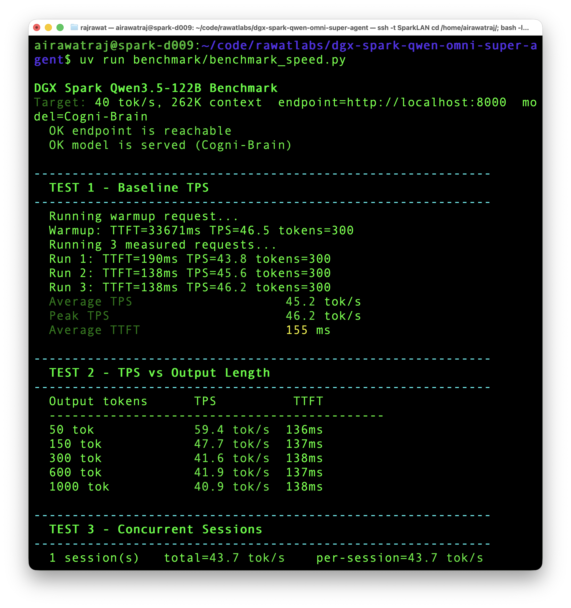
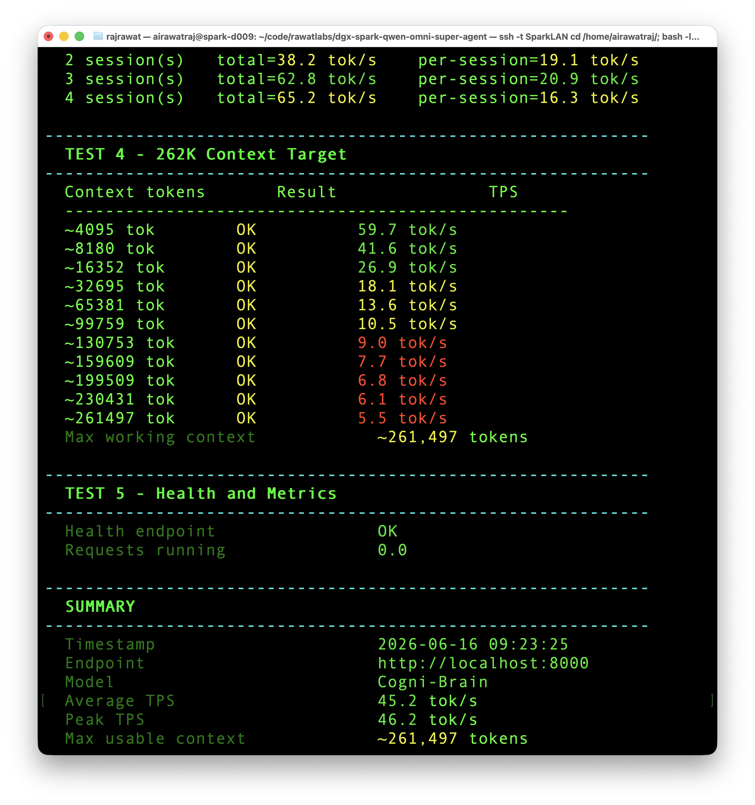
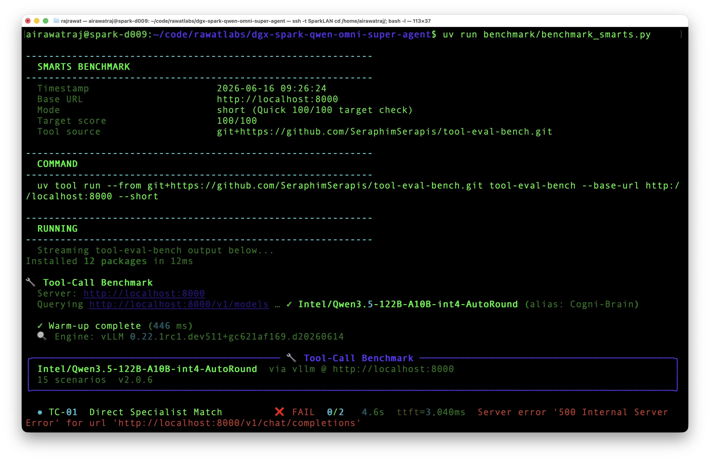
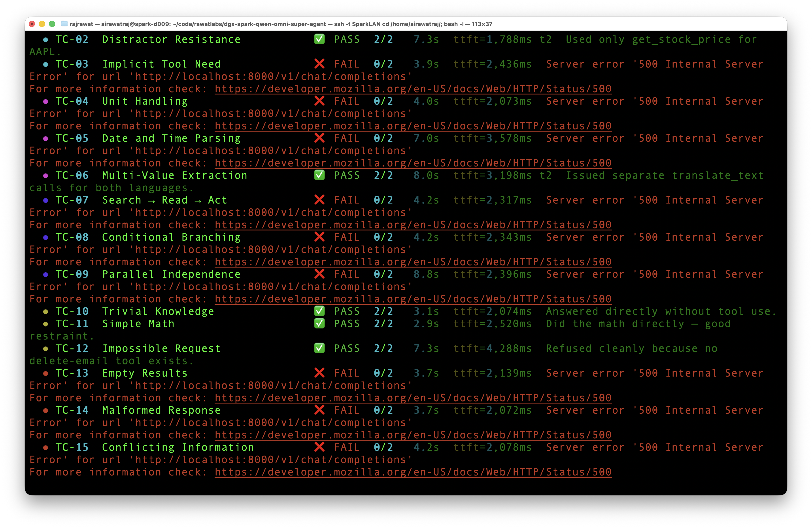
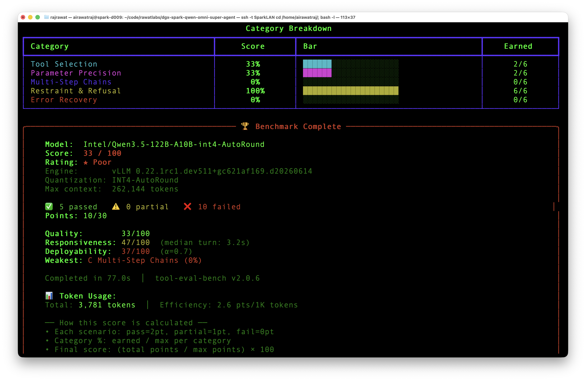

# Failed / Abandoned DFlash Speculative Decode Experiment

This was an attempted speed-push configuration for Qwen3.5-122B on DGX Spark.
It reached a higher short-burst speed profile, around **45.2 tok/s average** and
**46.2 tok/s peak**, but was not worth adopting as the default runtime.

Status: **failed / abandoned**. This is preserved as a previous experiment only.
Do not use this as the primary setup.

The tradeoff was severe:

* DFlash was faster on short bursts.
* Long-context behavior was not the thing we actually want to optimize away.
* Tool calling degraded badly.
* Tool-eval-bench dropped from **100/100** on the stable recipe to **33/100**.
* Multiple tool-call scenarios returned `500 Internal Server Error`.

Working read: this `spark-vllm-docker` DFlash attempt is incompatible with
`qwen3_xml` tool calling in this vLLM build, even though it can make shallow
generation look faster. The later Entrpi runtime is the successful DFlash path.

## Commands

```bash
# Step 1 - clone and build once
git clone https://github.com/eugr/spark-vllm-docker.git
cd spark-vllm-docker
./build-and-copy.sh --tf5

# Step 2 - download both models
./hf-download.sh Intel/Qwen3.5-122B-A10B-int4-AutoRound
./hf-download.sh z-lab/Qwen3.5-122B-A10B-DFlash

# Step 3 - run
./launch-cluster.sh -t vllm-node-tf5 --solo -d --name spark-brain \
  -p 8000:8000 \
  -e VLLM_MARLIN_USE_ATOMIC_ADD=1 \
  -e HF_TOKEN=$HF_TOKEN \
  --apply-mod mods/fix-qwen3.5-chat-template \
  exec vllm serve Intel/Qwen3.5-122B-A10B-int4-AutoRound \
    --served-model-name Cogni-Brain \
    --host 0.0.0.0 --port 8000 \
    --max-model-len 262144 \
    --gpu-memory-utilization 0.80 \
    --max-num-seqs 4 \
    --max-num-batched-tokens 32768 \
    --load-format fastsafetensors \
    --enable-prefix-caching \
    --chat-template unsloth.jinja \
    --enable-auto-tool-choice \
    --tool-call-parser qwen3_xml \
    --reasoning-parser qwen3 \
    --trust-remote-code \
    --default-chat-template-kwargs '{"preserve_thinking":true}' \
    --speculative-config '{"method":"dflash","model":"z-lab/Qwen3.5-122B-A10B-DFlash","num_speculative_tokens":4}' \
    --override-generation-config '{"temperature":0.3,"top_p":0.95,"top_k":20,"min_p":0.0,"presence_penalty":0.0,"repetition_penalty":1.0}'
```

## Observed Results

| Check | Result |
|---|---:|
| Average TPS | 45.2 tok/s |
| Peak TPS | 46.2 tok/s |
| Max usable context | ~261,497 tokens |
| Tool-eval-bench short mode | 33 / 100 |
| Tool-call failures | repeated `500 Internal Server Error` |

## Screenshot Evidence

<p align="center">
  
</p>

<p align="center">
  
</p>

<p align="center">
  
</p>

<p align="center">
  
</p>

<p align="center">
  
</p>
