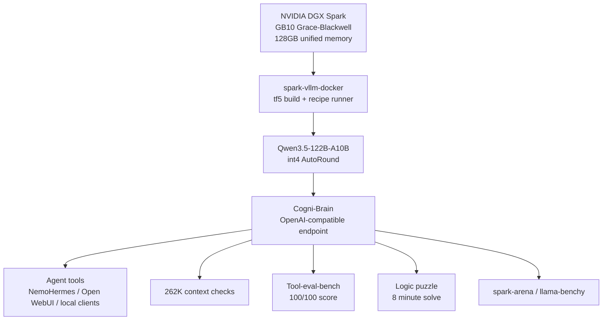

# DGX Spark Qwen Omni Super Agent

Local DGX Spark setup for running **Qwen3.5-122B-A10B** as a bigger-brain, long-context agent through the community [`spark-vllm-docker`](https://github.com/eugr/spark-vllm-docker) recipe stack.

This repo is the Qwen omni/super-agent sibling to:

| Repo | Role |
|---|---|
| [`dgx-spark-gemma4-omni-agent`](https://github.com/airawatraj/dgx-spark-gemma4-omni-agent) | native multimodal perception agent |
| [`dgx-spark-nemotron-super-agent`](https://github.com/airawatraj/dgx-spark-nemotron-super-agent) | large long-context reasoning agent |
| [`dgx-spark-qwen-super-agent`](https://github.com/airawatraj/dgx-spark-qwen-super-agent) | fast Atlas/NVFP4 Qwen text/tool agent |

This one is tuned for a different balance: **bigger brain, bigger context, practical speed**. The measured profile is around **40 tok/s**, **262K context**, **100/100 tool score**, and the hard local logic puzzle solved in about **8 minutes**.

> Personal workstation setup. Not for enterprise use. Use at your own risk.

## What Worked

The reliable path was to stop hand-assembling a long `docker run` and use the community recipe instead.

This is the easiest DGX Spark agent repo in the set because most of the hard runtime work is delegated to `spark-vllm-docker` and its predefined recipe. The other repos have more war stories from troubleshooting model caches, parsers, kernels, context ceilings, and custom launch flags by hand; this one is intentionally the cleaner "use the community recipe that works" path.

```bash
# 1. Clone and build once. This downloads prebuilt wheels.
git clone https://github.com/eugr/spark-vllm-docker.git
cd spark-vllm-docker
./build-and-copy.sh --tf5

# 2. Download the model.
./hf-download.sh Intel/Qwen3.5-122B-A10B-int4-AutoRound

# 3. Launch.
./run-recipe.sh qwen3.5-122b-int4-autoround --solo \
  -d --name spark-brain \
  -e HF_TOKEN=$HF_TOKEN \
  -- \
  --served-model-name Cogni-Brain \
  --speculative-config '{"method":"qwen3_next_mtp","num_speculative_tokens":2}'
```

The scripts in this repo wrap exactly that flow so the setup is reproducible and easy to tweak.

## Why This Setup

The earlier Qwen 35B setup chased maximum single-stream speed. This setup aims for the more stubborn middle ground:

* enough speed to stay usable as a local agent
* enough model capacity to feel less brittle on deep reasoning
* enough context for 262K-class working memory
* simple launch path using a predefined recipe
* OpenAI-compatible serving under the stable `Cogni-Brain` alias

The practical goal is to find the best DGX Spark brain for:

* NemoHermes agent runs through Telegram
* Claude Code on a MacBook using the DGX Spark as the local OpenAI-compatible backend
* long autonomous sessions where speed matters, but brittle shallow reasoning is worse

The model path used here is:

```text
Intel/Qwen3.5-122B-A10B-int4-AutoRound
```

The intended runtime recipe is:

```text
qwen3.5-122b-int4-autoround
```

## Architecture



## Quick Start

```bash
# 1. Verify prerequisites and clone/build spark-vllm-docker if needed.
bash setup/install.sh

# 2. Download the model through the community helper.
bash setup/download_model.sh

# 3. Launch the recipe.
bash docker/start.sh

# 4. Follow logs.
docker logs -f spark-brain
```

Stop:

```bash
bash docker/stop.sh
```

## Runtime Defaults

`docker/start.sh` is the canonical launch path.

| Setting | Default |
|---|---|
| `SPARK_VLLM_DIR` | `../spark-vllm-docker` |
| `MODEL_ID` | `Intel/Qwen3.5-122B-A10B-int4-AutoRound` |
| `RECIPE` | `qwen3.5-122b-int4-autoround` |
| `CONTAINER_NAME` | `spark-brain` |
| `SERVED_MODEL_NAME` | `Cogni-Brain` |
| `PORT` | `8000` |
| `SPECULATIVE_CONFIG` | `{"method":"qwen3_next_mtp","num_speculative_tokens":2}` |

Examples:

```bash
PORT=8001 CONTAINER_NAME=spark-brain-test bash docker/start.sh
SERVED_MODEL_NAME=Cogni-Brain-Qwen122 bash docker/start.sh
SPECULATIVE_CONFIG='{"method":"qwen3_next_mtp","num_speculative_tokens":1}' bash docker/start.sh
```

Extra arguments after `--` are passed through to vLLM:

```bash
bash docker/start.sh -- --max-model-len 262144 --gpu-memory-utilization 0.92
```

## Benchmarks

All benchmark wrappers assume the model is served as `Cogni-Brain` on `localhost:8000`.

```bash
# Speed, TTFT, concurrency, health, and 262K context checks.
uv run benchmark/benchmark_speed.py

# Tool-use smarts benchmark.
uv run benchmark/benchmark_smarts.py --mode short

# Hard logic puzzle run.
uv run benchmark/benchmark_puzzle.py

# spark-arena / llama-benchy sweep. This can take hours.
uv run benchmark/benchmark_speed_arena.py --save-result benchmark/results_arena.csv
```

The wrappers fetch `llama-benchy` and `tool-eval-bench` through `uv` on demand. Reruns may use newer upstream benchmark versions unless pinned locally.

## Which DGX Spark Agent Repo?

These are local-workstation comparison points from the adjacent repos and this repo. Treat them as practical operating notes, not universal model claims.

| Repo option | Model / runtime | Approx TPS | Tool score | Puzzle solve time | Context size | Concurrency stability | Best fit |
|---|---|---:|---:|---:|---:|---|---|
| `dgx-spark-qwen-omni-super-agent` | Qwen3.5-122B-A10B int4 AutoRound / `spark-vllm-docker` recipe | ~40 tok/s | 100/100 | ~8 min | 262K | expected to favor fewer deep sessions over many parallel jobs | Best candidate for bigger-brain NemoHermes + Claude Code |
| `dgx-spark-qwen-super-agent` | Qwen 3.6-35B-A3B NVFP4 / Atlas | ~128 tok/s local, 218.85 tok/s arena | 100/100 | ~30 sec | 131K | very fast, but more memory-sensitive at high concurrency / long context | Fastest tool agent and quick Claude Code backend |
| `dgx-spark-nemotron-super-agent` | Nemotron-3-Super-120B-A12B NVFP4 / vLLM | ~24 tok/s local, 23.71 tok/s arena | 93/100 | solved; slower deliberate reasoning | 131K | stable long runs; 4-session aggregate ~53.9 tok/s, but deep simultaneous reasoning can hit kernel issues | Reliable large reasoning brain for long NemoHermes jobs |
| `dgx-spark-gemma4-omni-agent` | Gemma 4 12B / vLLM omni profile | ~25-30 tok/s local, 22.11 tok/s arena | 83/100 | visual puzzle smoke passed | 196K daily target; 262K can boot but unreliable with full stack | good for multimodal smoke tests, less ideal as main coding brain | Native image/audio/video-as-frames perception |

Current read: Qwen3.5-122B is the one to test hardest for the MacBook + Telegram workflow because it preserves more of the 120B-class reasoning feel while keeping enough speed for interactive agent loops and opening the context window to 262K.

## Benchmark Results

> Results vary with recipe version, model revision, context length, concurrency, memory pressure, and upstream benchmark versions.

| Check | Result |
|---|---:|
| Single-stream generation | 40 tok/s |
| Usable context | 262,144 tokens |
| Tool-eval-bench short mode | 100 / 100 |
| Puzzle solution | <= 8 minutes |
| Runtime path | `spark-vllm-docker` recipe |
| Served model name | `Cogni-Brain` |

## Repository Structure

```text
.
+-- README.md
+-- CITATION.cff
+-- LICENSE
+-- assets/
+-- setup/
|   +-- install.sh
|   +-- download_model.sh
+-- docker/
|   +-- start.sh
|   +-- status.sh
|   +-- stop.sh
+-- benchmark/
    +-- benchmark_speed.py
    +-- benchmark_smarts.py
    +-- benchmark_puzzle.py
    +-- benchmark_speed_arena.py
```

## Notes

* This repo does not vendor `spark-vllm-docker`; it clones it beside this repo by default.
* `HF_TOKEN` should be exported before launch when model access requires authentication.
* The recipe owns most low-level vLLM configuration. Keep overrides minimal unless you are intentionally exploring a new performance envelope.
* For clean arena measurements, stop other local agent containers before running the long `llama-benchy` sweep.
