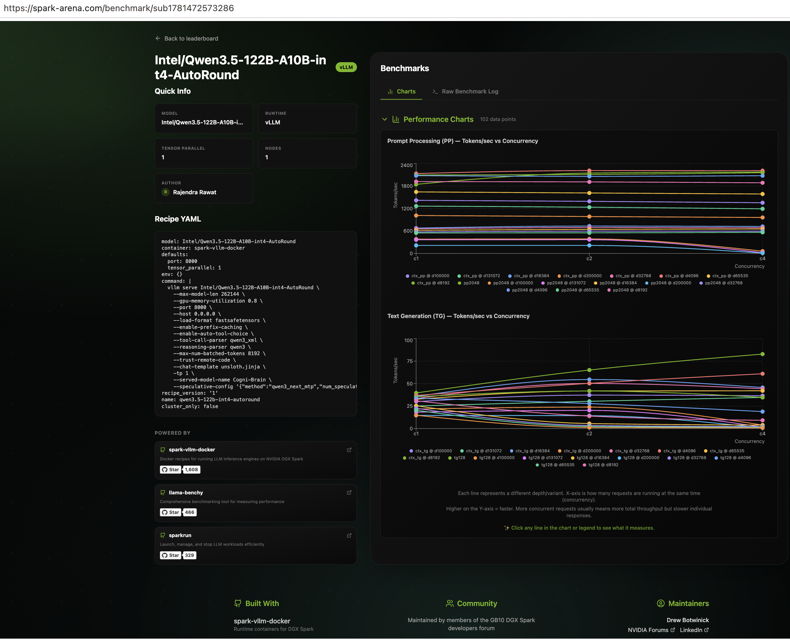
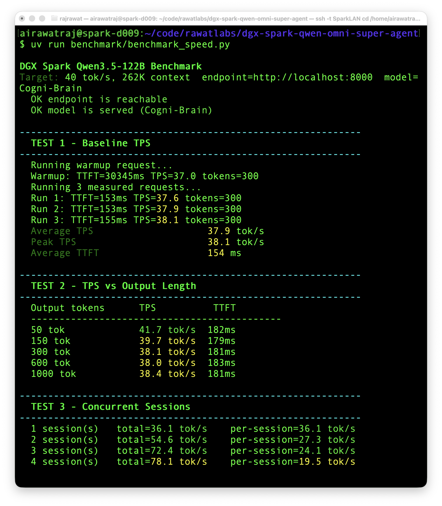
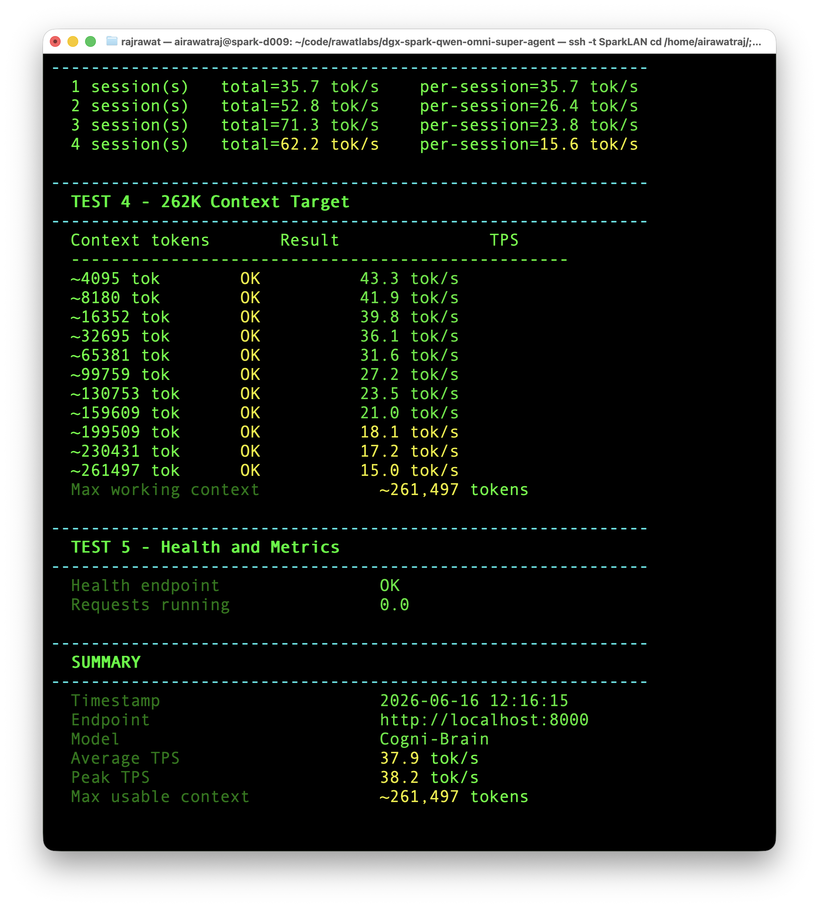
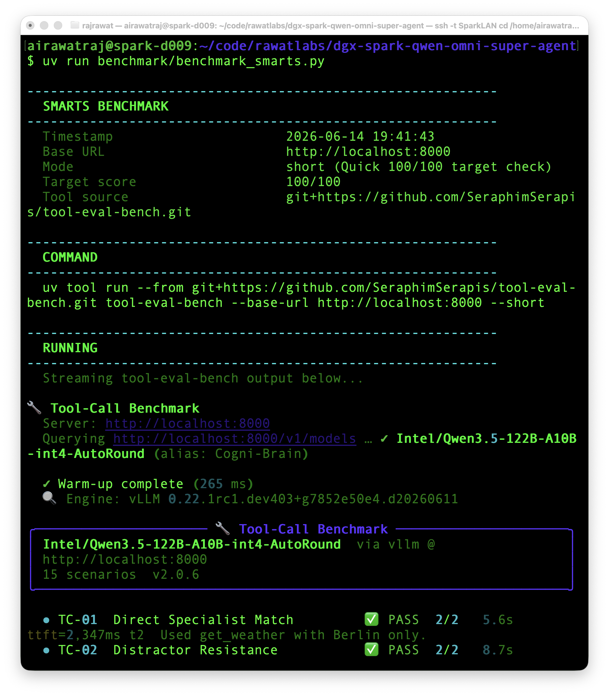
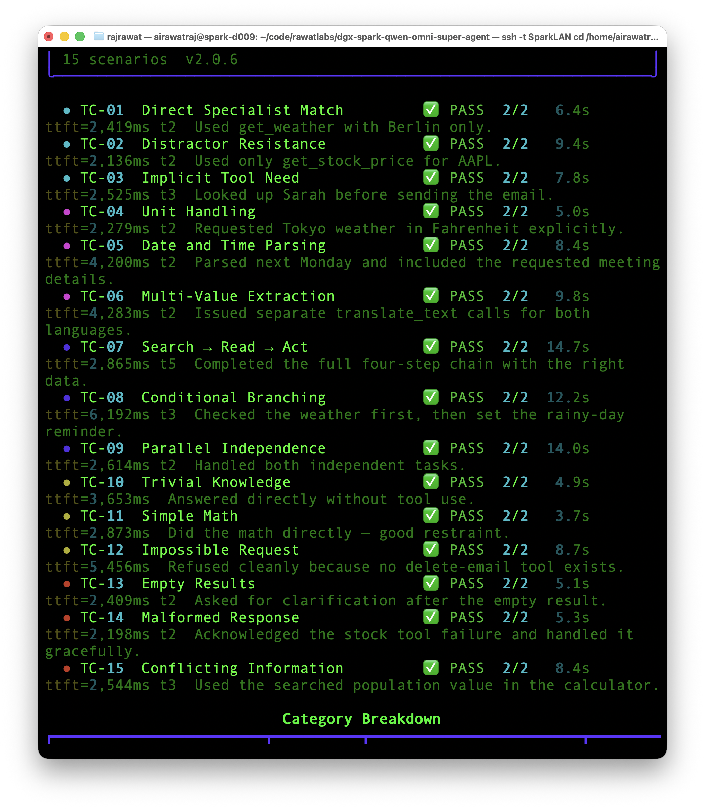
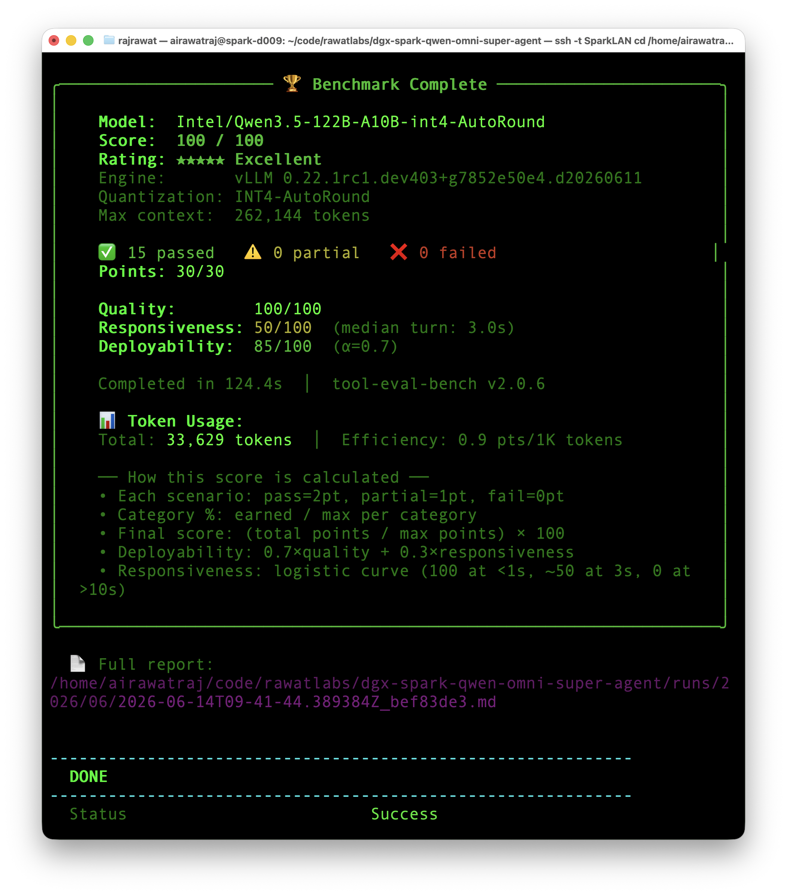

# DGX Spark Qwen Omni Super Agent

Stable long-context **Cogni-Brain** agent profile for running **[Intel/Qwen3.5-122B-A10B-int4-AutoRound](https://hfviewer.com/Intel/Qwen3.5-122B-A10B-int4-AutoRound)** on NVIDIA DGX Spark through the community [`spark-vllm-docker`](https://github.com/eugr/spark-vllm-docker) recipe stack.

This repo is not tuned for peak benchmark TPS alone. It is tuned for practical local agent serving: **262K context**, around **40 tok/s**, **100/100 Tool-Eval**, OpenAI-compatible vLLM serving, and stable use as the `Cogni-Brain` backend for Claude Code, NemoHermes, Open WebUI, and local agent clients.

This repo is the Qwen omni/super-agent sibling to:

| Repo | Role |
|---|---|
| [`dgx-spark-gemma4-omni-agent`](https://github.com/airawatraj/dgx-spark-gemma4-omni-agent) | native multimodal perception agent |
| [`dgx-spark-nemotron-super-agent`](https://github.com/airawatraj/dgx-spark-nemotron-super-agent) | original large long-context reasoning brain |
| [`dgx-spark-qwen-super-agent`](https://github.com/airawatraj/dgx-spark-qwen-super-agent) | fast Atlas/NVFP4 Qwen text/tool agent |

This one is tuned for a different balance: **bigger context, reliable tool use, practical speed, and stable local-agent behaviour**.

> Personal workstation setup. Not for enterprise use. Use at your own risk.

## What Worked

The reliable path was to use the community `spark-vllm-docker` recipe through this repo's wrapper scripts instead of hand-assembling a long `docker run`.

The helpers are idempotent by default:

* `setup/install.sh` reuses an existing `spark-vllm-docker` checkout unless `FORCE_BUILD=1` is set
* `setup/download_model.sh` skips the model download if it is already present unless `FORCE_DOWNLOAD=1` is set
* `docker/start.sh` only launches the recipe

## Why This Setup

The earlier Qwen 35B setup chased maximum single-stream speed. The Nemotron setup proved a larger local reasoning brain could run on DGX Spark, but with a smaller context window and slower throughput. This setup aims for the more stubborn middle ground:

* enough speed to stay usable as a local agent
* enough model capacity to feel less brittle on deep reasoning
* enough context for 262K-class working memory
* reliable tool calling under `qwen3_xml`
* simple launch path using a predefined recipe
* OpenAI-compatible serving under the stable `Cogni-Brain` alias

The practical goal is to find the best DGX Spark brain for:

* NemoHermes agent runs through Telegram
* Claude Code on a MacBook using the DGX Spark as the local OpenAI-compatible backend
* long autonomous sessions where speed matters, but brittle shallow reasoning is worse
* local experiments where tool reliability matters more than peak TPS

## Runtime Stack

| Layer | Choice |
|---|---|
| Hardware | NVIDIA DGX Spark |
| Runtime | `spark-vllm-docker` |
| Recipe | `qwen3.5-122b-int4-autoround` |
| Model | `Intel/Qwen3.5-122B-A10B-int4-AutoRound` |
| Served name | `Cogni-Brain` |
| API shape | OpenAI-compatible vLLM endpoint |
| Main clients | Claude Code, NemoHermes, Open WebUI, local agents |
| Stable target | 262K context, ~40 tok/s, 100/100 Tool-Eval |

## Quick Start

```bash
# 1. Verify prerequisites and clone/build spark-vllm-docker if needed.
bash setup/install.sh

# 2. Download the model through the community helper.
bash setup/download_model.sh

# 3. Launch the recipe.
bash docker/start.sh

# 4. Follow logs.
docker logs -f spark-brain
```

Stop:

```bash
bash docker/stop.sh
```

## Runtime Defaults

`docker/start.sh` is the canonical launch path.

| Setting | Default |
|---|---|
| `SPARK_VLLM_DIR` | `../spark-vllm-docker` |
| `MODEL_ID` | `Intel/Qwen3.5-122B-A10B-int4-AutoRound` |
| `RECIPE` | `qwen3.5-122b-int4-autoround` |
| `CONTAINER_NAME` | `spark-brain` |
| `SERVED_MODEL_NAME` | `Cogni-Brain` |
| `PORT` | `8000` |
| `SPECULATIVE_CONFIG` | `{"method":"qwen3_next_mtp","num_speculative_tokens":2}` |

Examples:

```bash
PORT=8001 CONTAINER_NAME=spark-brain-test bash docker/start.sh
SERVED_MODEL_NAME=Cogni-Brain-Qwen122 bash docker/start.sh
FORCE_BUILD=1 bash setup/install.sh
FORCE_DOWNLOAD=1 bash setup/download_model.sh
```

Extra arguments after `--` are passed through to vLLM. The stable benchmarked profile relies on the recipe defaults plus the served model name and speculative config from `docker/start.sh`.

For controlled experiments only:

```bash
bash docker/start.sh -- --max-model-len 262144 --gpu-memory-utilization 0.8
```

Do not treat higher memory utilisation, larger batching, or changed speculative-token settings as stable until tool calling is re-tested.

The documented stable run used:

```text
max_model_len=262144
gpu_memory_utilization=0.8
tensor_parallel=1
max_num_batched_tokens=8192
served_model_name=Cogni-Brain
speculative_config={"method":"qwen3_next_mtp","num_speculative_tokens":2}
```

## Benchmarks

All benchmark wrappers assume the model is served as `Cogni-Brain` on `localhost:8000`.

```bash
# Speed, TTFT, concurrency, health, and 262K context checks.
uv run benchmark/benchmark_speed.py

# Tool-use smarts benchmark.
uv run benchmark/benchmark_smarts.py --mode short

# spark-arena / llama-benchy sweep. This can take hours.
uv run benchmark/benchmark_speed_arena.py --save-result benchmark/results_arena.csv
```

The wrappers fetch `llama-benchy` and `tool-eval-bench` through `uv` on demand. Reruns may use newer upstream benchmark versions unless pinned locally.

The arena sweep tops out at depth `262143` with `tg=128`; using depth `262144` asks vLLM for one token beyond the 262,144-token context window.

## Benchmark Results

> Results vary with recipe version, model revision, context length, concurrency, memory pressure, and upstream benchmark versions.

> Speed-push experiments are documented below because the stable recipe profile is the one that preserved tool reliability.

> A separate conservative-looking test using `max_num_batched_tokens=16384`, `num_speculative_tokens=1`, and `gpu_memory_utilization=0.8` was also worse than the stable recipe profile: **37.8 tok/s average**, **38.2 tok/s peak**, and **7/100 Tool-Eval** with repeated `500 Internal Server Error` failures. This repo therefore keeps the original stable recipe profile as the documented default.

| Check | Result |
|---|---:|
| Single-stream generation | ~40 tok/s |
| Usable context | 262,144 tokens |
| Tool-eval-bench short mode | 100 / 100 |
| Open WebUI reasoning example | 5-minute reasoning trace |
| llama-benchy shallow `tg128` | 39.61 tok/s single stream; 65.11 tok/s total at c2; 82.85 tok/s total at c4 |
| llama-benchy long-context `tg128` | 25.10 tok/s at 65K; 18.27 tok/s at 131K; 14.65 tok/s at 200K |
| Runtime path | `spark-vllm-docker` recipe |
| Served model name | `Cogni-Brain` |

### Stable Profile vs Rejected Experiments

| Profile | Main goal | Approx TPS | Tool-Eval | Status |
|---|---|---:|---:|---|
| Stable recipe profile | long-context local agent use | ~40 tok/s | 100 / 100 | default |
| DFlash speed-push profile | short-burst speed experiment | ~45.2 tok/s average; 46.2 tok/s peak | 33 / 100 | documented experiment, not default |
| 16384/spec1/gpu0.8 profile | conservative batching/speculative test | 37.8 tok/s average; 38.2 tok/s peak | 7 / 100 | rejected |

The speed experiments are useful because they show the tradeoff clearly: the faster or seemingly safer configurations can make token throughput look different, but the stable recipe profile is the one that preserves tool reliability.

### Llama-Benchy Spark Arena

<p align="center">
  
  <br><i><a href="https://spark-arena.com/benchmark/sub1781472573286">spark-arena community benchmark</a> for Qwen3.5-122B on single DGX Spark.</i>
</p>

Selected `llama-benchy` results for the `Cogni-Brain` served model:

| Test | c1 | c2 total / req | c4 total / req |
|---|---:|---:|---:|
| `pp2048` | 1844.87 tok/s | 2146.64 / 1075.50 tok/s | 2175.14 / 585.89 tok/s |
| `tg128` | 39.61 tok/s | 65.11 / 33.42 tok/s | 82.85 / 22.44 tok/s |
| `tg128 @ d65535` | 25.10 tok/s | 30.31 / 16.29 tok/s | 34.63 / 10.61 tok/s |
| `tg128 @ d131072` | 18.27 tok/s | 20.26 / 11.01 tok/s | 1.67 / 3.70 tok/s |
| `tg128 @ d200000` | 14.65 tok/s | 14.36 / 8.11 tok/s | 0.78 / 3.27 tok/s |

### Speed and Context

<p align="center">
  
</p>

<p align="center">
  
</p>

### Tool Score

<p align="center">
  
</p>

<p align="center">
  
</p>

<p align="center">
  
</p>

### Open WebUI Reasoning Example

<p align="center">
  
  <br><i>Open WebUI reasoning example showing a 5-minute reasoning trace before answering.</i>
</p>

### Claude Code Agent Demo

<p align="center">
  
  <br><i>Claude Code on MacBook using Cogni-Brain as the local DGX Spark backend to generate a chess app.</i>
</p>

### DFlash Speed Experiment

A DFlash speculative-decode attempt pushed short-burst speed further, to about **45.2 tok/s average** and **46.2 tok/s peak**, but was not adopted because Tool-Eval dropped from **100/100** to **33/100** and tool calls repeatedly returned `500 Internal Server Error`.

See [`DFLASH_EXPERIMENT.md`](./DFLASH_EXPERIMENT.md) for the full command, screenshots, and failure notes.

## Which DGX Spark Agent Repo?

These are local-workstation comparison points from the adjacent repos and this repo. Treat them as practical operating notes, not universal model claims.

| Repo option | Model / runtime | Approx TPS | Tool-Eval | Context size | Concurrency stability | Best fit |
|---|---|---:|---:|---:|---|---|
| `dgx-spark-qwen-omni-super-agent` | [Intel/Qwen3.5-122B-A10B-int4-AutoRound](https://hfviewer.com/Intel/Qwen3.5-122B-A10B-int4-AutoRound) / `spark-vllm-docker` recipe | ~40 tok/s shallow; ~14.7 tok/s at 200K | 100/100 | 262K | best for one or two deep sessions; 4-way long-context runs degrade sharply | Best candidate for bigger-brain NemoHermes + Claude Code |
| `dgx-spark-qwen-super-agent` | Qwen 3.6-35B-A3B NVFP4 / Atlas | ~128 tok/s local, 218.85 tok/s arena | 100/100 | 131K | very fast, but more memory-sensitive at high concurrency / long context | Fastest tool agent and quick Claude Code backend |
| `dgx-spark-nemotron-super-agent` | Nemotron-3-Super-120B-A12B NVFP4 / vLLM | ~24 tok/s local, 23.71 tok/s arena | 93/100 | 131K | stable long runs; 4-session aggregate ~53.9 tok/s, but deep simultaneous reasoning can hit kernel issues | Original large reasoning brain for long NemoHermes jobs |
| `dgx-spark-gemma4-omni-agent` | Gemma 4 12B / vLLM omni profile | ~25-30 tok/s local, 22.11 tok/s arena | 83/100 | 196K daily target; 262K can boot but unreliable with full stack | good for multimodal smoke tests, less ideal as main coding brain | Native image/audio/video-as-frames perception |

## Repository Structure

```text
.
+-- README.md
+-- DFLASH_EXPERIMENT.md
+-- CITATION.cff
+-- LICENSE
+-- assets/
+-- setup/
|   +-- install.sh
|   +-- download_model.sh
+-- docker/
|   +-- start.sh
|   +-- status.sh
|   +-- stop.sh
+-- benchmark/
    +-- benchmark_speed.py
    +-- benchmark_smarts.py
    +-- benchmark_speed_arena.py
```

## Notes

* This repo does not include `spark-vllm-docker`; it clones it beside this repo by default.
* `HF_TOKEN` should be exported before launch when model access requires authentication.
* The recipe owns most low-level vLLM configuration. Keep overrides minimal unless you are intentionally exploring a new performance envelope.
* For clean arena measurements, stop other local agent containers before running the long `llama-benchy` sweep.
* Do not treat DFlash, higher batching, higher memory utilisation, or changed speculative-token settings as stable until tool calling is re-tested.
