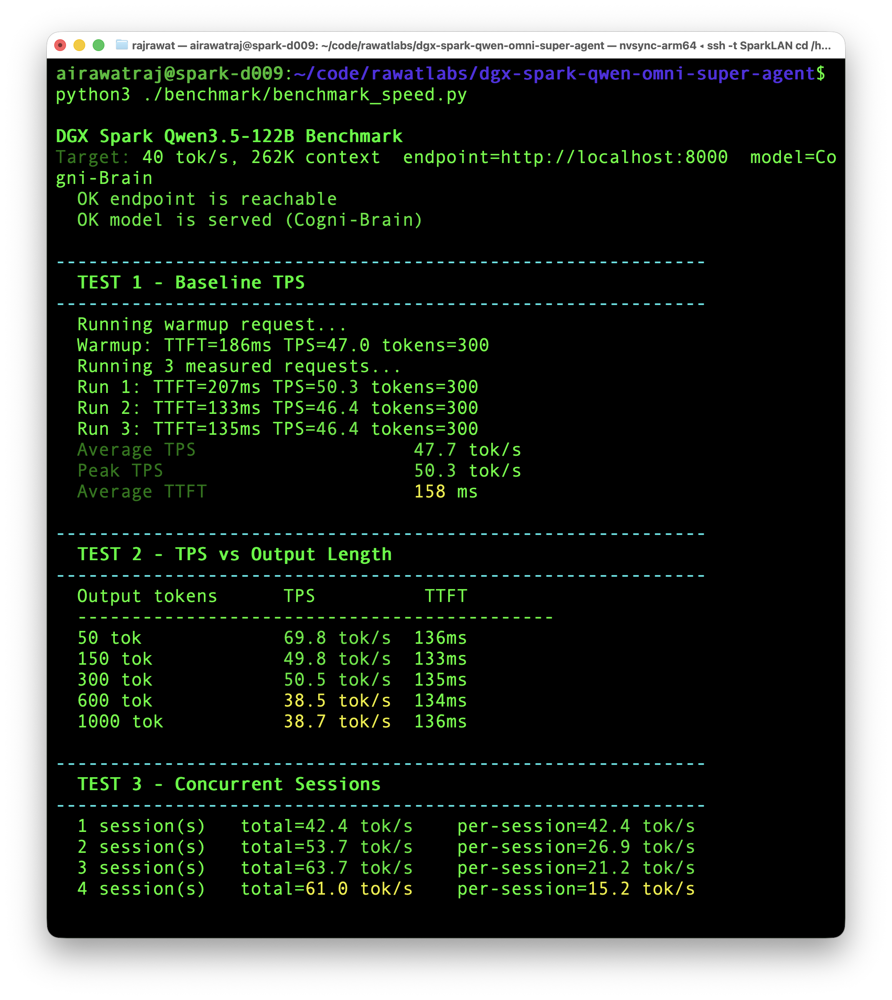
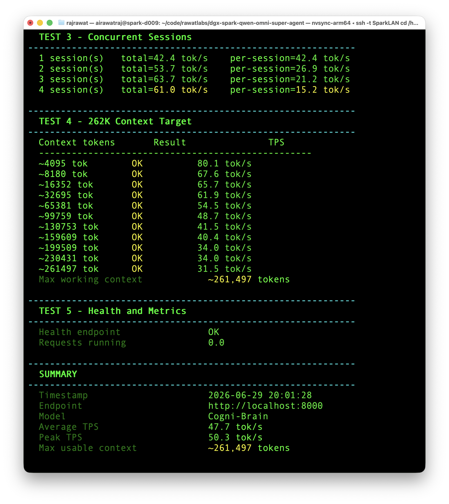
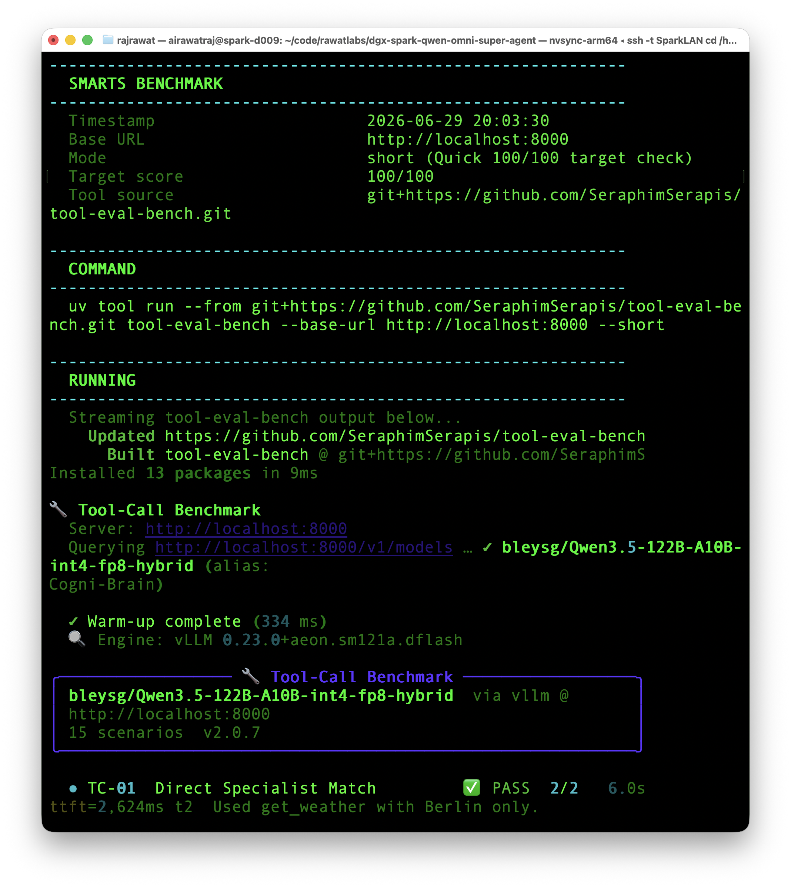
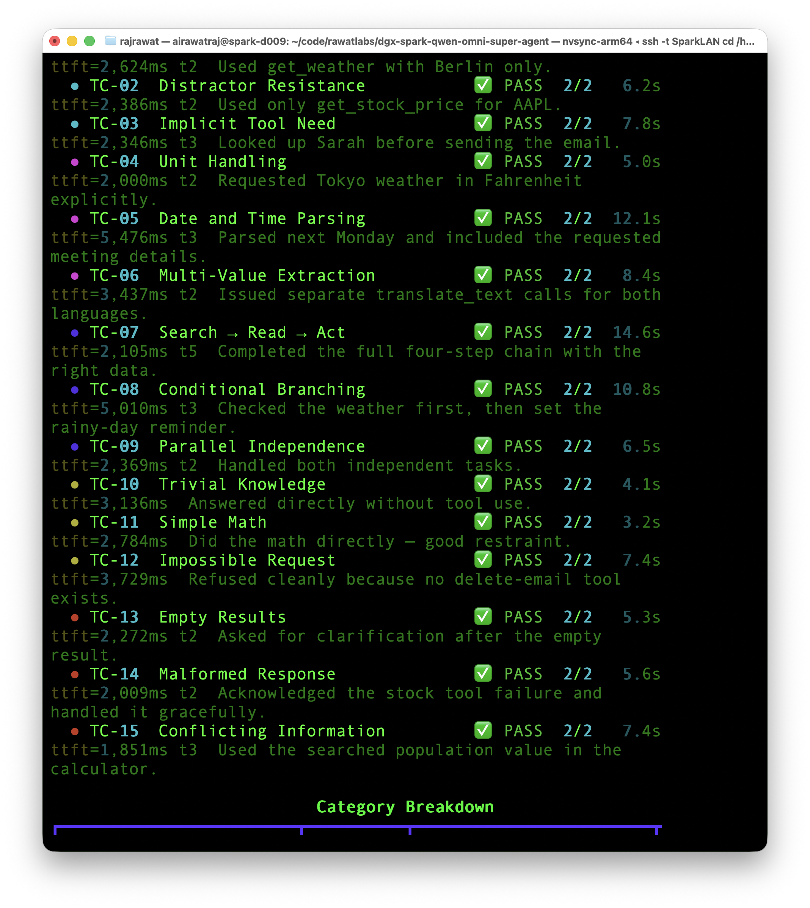
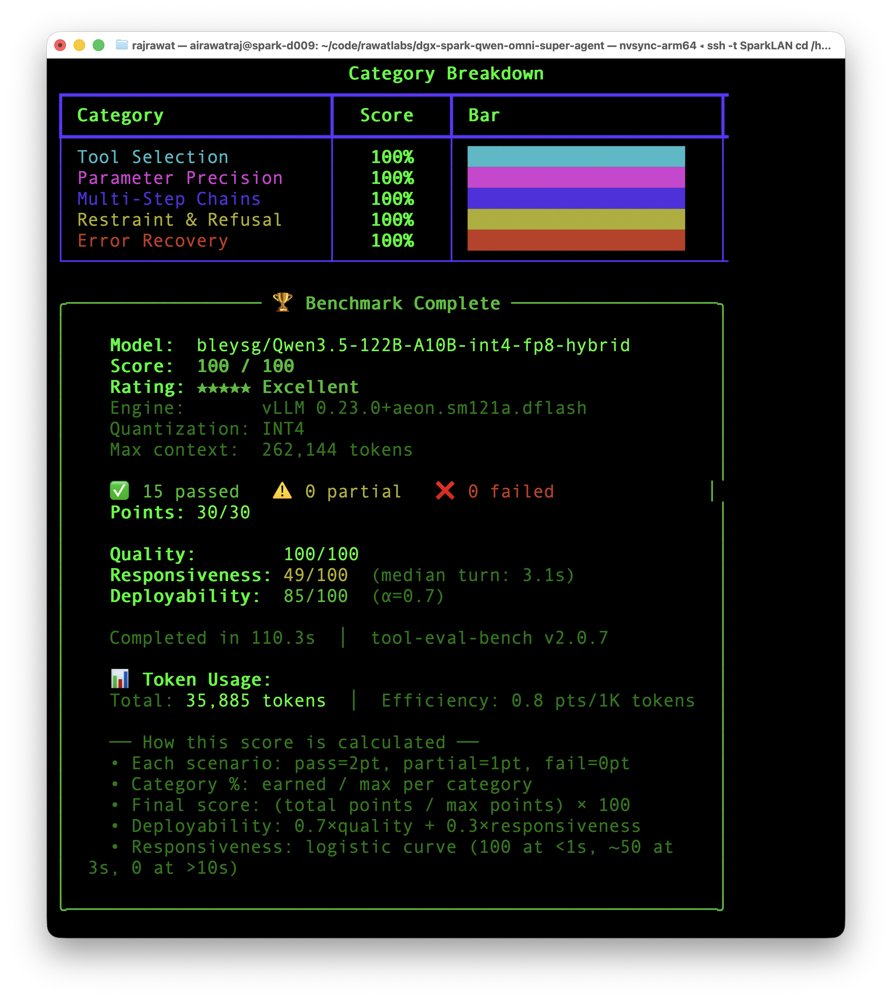
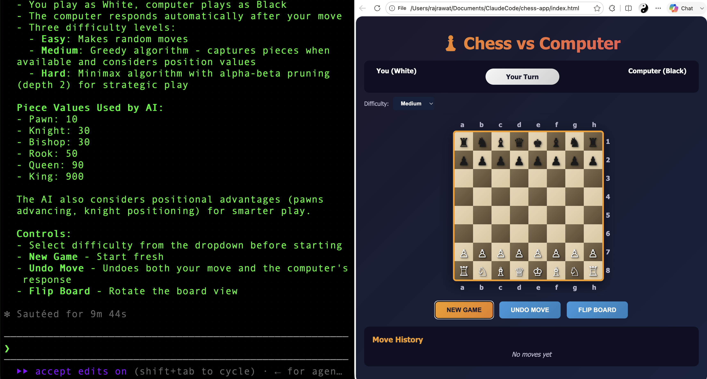
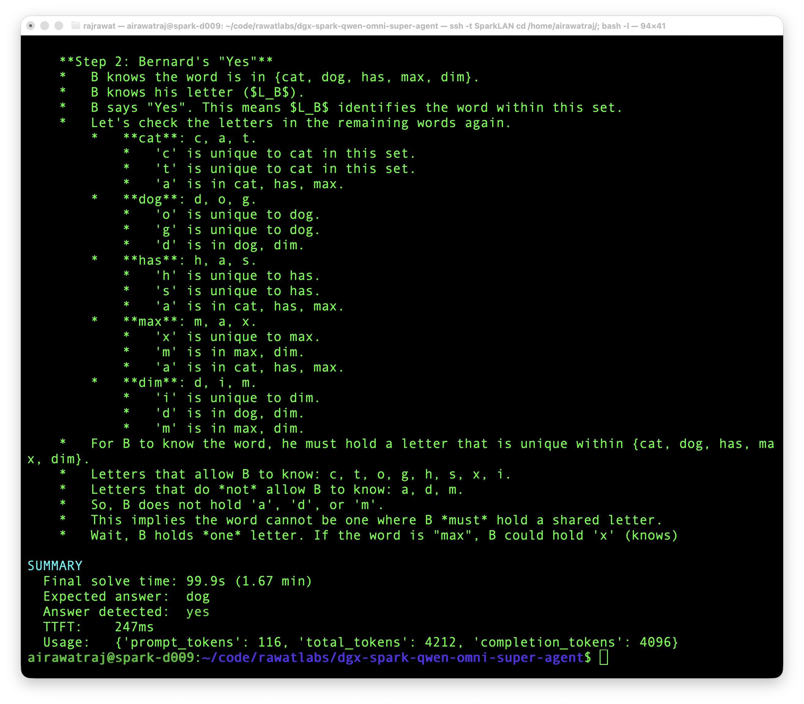

# DGX Spark Qwen Omni Super Agent

Stable long-context **Cogni-Brain** agent profile for running **[bleysg/Qwen3.5-122B-A10B-int4-fp8-hybrid](https://hfviewer.com/bleysg/Qwen3.5-122B-A10B-int4-fp8-hybrid)** on NVIDIA DGX Spark with **DFlash speculative decoding n=12** via **[z-lab/Qwen3.5-122B-A10B-DFlash](https://hfviewer.com/z-lab/Qwen3.5-122B-A10B-DFlash)**.

The primary stable setup is the Entrpi dense DFlash runtime from [`qwen3.5-122B-A10B-on-spark`](https://github.com/Entrpi/qwen3.5-122B-A10B-on-spark). Setup credit for the primary run goes to Entrpi. It is the run to use first: **54.44 tok/s single-stream (`tg128 c1`)**, **68 tok/s peak**, **262K context**, **3 concurrent streams**, OpenAI-compatible vLLM serving, and stable use as the `Cogni-Brain` backend for Claude Code, NemoHermes, Open WebUI, and local agent clients.


This repo is the Qwen omni/super-agent sibling to:

| Repo | Role |
|---|---|
| [`dgx-spark-gemma4-omni-agent`](https://github.com/airawatraj/dgx-spark-gemma4-omni-agent) | native multimodal perception agent |
| [`dgx-spark-nemotron-super-agent`](https://github.com/airawatraj/dgx-spark-nemotron-super-agent) | original large long-context reasoning brain |
| [`dgx-spark-qwen-super-agent`](https://github.com/airawatraj/dgx-spark-qwen-super-agent) | fast Atlas/NVFP4 Qwen text/tool agent |

This one is tuned for a different balance: **bigger context, reliable tool use, practical speed, and stable local-agent behaviour**.

> Personal workstation setup. Not for enterprise use. Use at your own risk.


## Why This Setup

The earlier Qwen 35B setup chased maximum single-stream speed. The Nemotron setup proved a larger local reasoning brain could run on DGX Spark, but with a smaller context window and slower throughput. This setup aims for the more stubborn middle ground:

* enough speed to stay usable as a local agent
* enough model capacity to feel less brittle on deep reasoning
* enough context for 262K-class working memory
* reliable dense DFlash serving through the Entrpi runtime
* simple launch path using this repo's own `setup/install.sh` and `docker/start.sh`
* OpenAI-compatible serving under the stable `Cogni-Brain` alias

The practical goal is to find the best DGX Spark brain for:

* NemoHermes agent runs through Telegram
* Claude Code on a MacBook using the DGX Spark as the local OpenAI-compatible backend
* long autonomous sessions where speed matters, but brittle shallow reasoning is worse
* local experiments where tool reliability matters more than peak TPS

## Runtime Stack

| Layer | Choice |
|---|---|
| Hardware | NVIDIA DGX Spark |
| Runtime | Entrpi [`qwen3.5-122B-A10B-on-spark`](https://github.com/Entrpi/qwen3.5-122B-A10B-on-spark) |
| Model | `bleysg/Qwen3.5-122B-A10B-int4-fp8-hybrid` |
| Quantization | INT4+FP8 hybrid |
| Speculative decoding | DFlash n=12 via `z-lab/Qwen3.5-122B-A10B-DFlash` |
| Served name | `Cogni-Brain` |
| API shape | OpenAI-compatible vLLM endpoint |
| Main clients | Claude Code, NemoHermes, Open WebUI, local agents |
| Stable result | 54.44 tok/s single-stream (`tg128 c1`), 68 tok/s peak, 262K context, 3 concurrent streams |

## Quick Start

```bash
# 1. Verify prerequisites, clone the Entrpi runtime, patch the served model
#    name to Cogni-Brain, and download both models.
bash setup/install.sh

# 2. Launch the container.
bash docker/start.sh

# 3. Follow logs.
docker logs -f spark-brain
```

Stop:

```bash
bash docker/stop.sh
```

Subsequent starts (models already downloaded):

```bash
bash docker/start.sh
```

## Runtime Defaults

| Setting | Default |
|---|---|
| Runtime checkout | `~/cogni-brain` |
| Container image | `ghcr.io/aeon-7/aeon-vllm-ultimate:2026-06-18-v0.23.0-dflashfix` |
| Container name | `spark-brain` |
| Model | `bleysg/Qwen3.5-122B-A10B-int4-fp8-hybrid` |
| Drafter | `z-lab/Qwen3.5-122B-A10B-DFlash` |
| Speculative decoding | DFlash n=12 (set by Entrpi runtime; override via `--nspec N` as an extra arg) |
| Served model name | `Cogni-Brain` (patched into Entrpi's `runtime/serve.sh` by `setup/install.sh`) |
| `PORT` | `8000` |

## Benchmarks

All benchmark wrappers assume the model is served as `Cogni-Brain` on `localhost:8000`.

```bash
# Speed, TTFT, concurrency, health, and 262K context checks.
uv run benchmark/benchmark_speed.py

# Tool-use smarts benchmark.
uv run benchmark/benchmark_smarts.py --mode short

# spark-arena / llama-benchy sweep. This can take hours.
uv run benchmark/benchmark_speed_arena.py --save-result benchmark/results_arena.csv
```

The wrappers fetch `llama-benchy` and `tool-eval-bench` through `uv` on demand. Reruns may use newer upstream benchmark versions unless pinned locally.

The arena sweep tops out at depth `262143` with `tg=128`; using depth `262144` asks vLLM for one token beyond the 262,144-token context window.

## Benchmark Results

> Results vary with recipe version, model revision, context length, concurrency, memory pressure, and upstream benchmark versions. Previous experiments are documented below because they explain why the Entrpi DFlash runtime became the primary setup.

| Check | Result |
|---|---:|
| Model | `bleysg/Qwen3.5-122B-A10B-int4-fp8-hybrid` |
| Speculative decoding | DFlash n=12 via `z-lab/Qwen3.5-122B-A10B-DFlash` |
| Single-stream generation | 54.44 tok/s (`tg128 c1`) |
| Peak generation | 68 tok/s |
| Usable context | 262,144 tokens |
| Concurrent streams | 3 |
| Tool-eval-bench short mode | 100 / 100 |

## Spark Arena

<p align="center">
  
  <br><i><a href="https://spark-arena.com/benchmark/sub1782762533406">spark-arena community benchmark</a> for Qwen3.5-122B on single DGX Spark.</i>
</p>


### Stable Profile vs Experiments

| Profile | Main goal | Approx TPS | Tool-Eval | Status |
|---|---|---:|---:|---|
| Entrpi dense DFlash runtime | primary stable local agent use | 54.44 tok/s `tg128 c1`; 68 tok/s peak | 100 / 100 | default |
| AutoRound baseline recipe profile | previous long-context baseline | ~40 tok/s | 100 / 100 | preserved previous run |
| Failed DFlash speed-push profile | abandoned short-burst speed experiment | ~45.2 tok/s average; 46.2 tok/s peak | 33 / 100 | failed / abandoned |

The speed experiments are useful because they show the tradeoff clearly: the first `spark-vllm-docker` DFlash attempt was faster but broke tool reliability, while the Entrpi DFlash runtime preserved the 100/100 tool score and became the primary stable setup.

### Speed Test

<p align="center">
  
</p>

<p align="center">
  
</p>

### Tool-Eval

<p align="center">
  
</p>

<p align="center">
  
</p>

<p align="center">
  
</p>

### Agent in Use

<p align="center">
  
</p>

<p align="center">
  
</p>

## Previous Run: AutoRound Baseline

The previous baseline used INT4 AutoRound + MTP through `spark-vllm-docker`, reached about **40 tok/s**, and preserved **100/100 Tool-Eval**; see [`AUTOROUND_EXPERIMENT.md`](./AUTOROUND_EXPERIMENT.md) for full setup notes, benchmark tables, and screenshots.

### Failed / Abandoned DFlash Speed Experiment

A DFlash speculative-decode attempt pushed short-burst speed further, to about **45.2 tok/s average** and **46.2 tok/s peak**, but was not adopted because Tool-Eval dropped from **100/100** to **33/100** and tool calls repeatedly returned `500 Internal Server Error`.

See [`DFLASH_EXPERIMENT.md`](./DFLASH_EXPERIMENT.md) for the full command, screenshots, and failure notes.


## Which DGX Spark Agent Repo?

These are local-workstation comparison points from the adjacent repos and this repo. Treat them as practical operating notes, not universal model claims.

| Repo option | Model / runtime | Approx TPS | Tool-Eval | Context size | Concurrency stability | Best fit |
|---|---|---:|---:|---:|---|---|
| `dgx-spark-qwen-omni-super-agent` | [bleysg/Qwen3.5-122B-A10B-int4-fp8-hybrid](https://hfviewer.com/bleysg/Qwen3.5-122B-A10B-int4-fp8-hybrid) + `z-lab/Qwen3.5-122B-A10B-DFlash` / Entrpi runtime | 54.44 tok/s `tg128 c1`; 68 tok/s peak | 100/100 | 262K | primary run supports 3 concurrent streams | Best candidate for bigger-brain NemoHermes + Claude Code |
| `dgx-spark-qwen-super-agent` | Qwen 3.6-35B-A3B NVFP4 / Atlas | ~128 tok/s local, 218.85 tok/s arena | 100/100 | 131K | very fast, but more memory-sensitive at high concurrency / long context | Fastest tool agent and quick Claude Code backend |
| `dgx-spark-nemotron-super-agent` | Nemotron-3-Super-120B-A12B NVFP4 / vLLM | ~24 tok/s local, 23.71 tok/s arena | 93/100 | 131K | stable long runs; 4-session aggregate ~53.9 tok/s, but deep simultaneous reasoning can hit kernel issues | Original large reasoning brain for long NemoHermes jobs |
| `dgx-spark-gemma4-omni-agent` | Gemma 4 12B / vLLM omni profile | ~25-30 tok/s local, 22.11 tok/s arena | 83/100 | 196K daily target; 262K can boot but unreliable with full stack | good for multimodal smoke tests, less ideal as main coding brain | Native image/audio/video-as-frames perception |

## Repository Structure

```text
.
+-- README.md
+-- AUTOROUND_EXPERIMENT.md    (previous baseline, preserved)
+-- DFLASH_EXPERIMENT.md       (failed attempt, preserved)
+-- CITATION.cff
+-- LICENSE
+-- assets/
+-- setup/
|   +-- install.sh                     (clone Entrpi runtime, patch, download models)
|   +-- download_model.sh              (download primary model and drafter)
|   +-- autoround_install.sh           (AutoRound baseline: clone spark-vllm-docker)
|   +-- autoround_download_model.sh    (AutoRound baseline: download model)
+-- docker/
|   +-- start.sh                       (launch primary DFlash dense setup)
|   +-- status.sh
|   +-- stop.sh
|   +-- autoround_start.sh             (AutoRound baseline launch)
|   +-- autoround_status.sh
|   +-- autoround_stop.sh
+-- benchmark/
    +-- benchmark_speed.py
    +-- benchmark_smarts.py
    +-- benchmark_speed_arena.py           (primary DFlash arena sweep)
    +-- benchmark_speed_arena_autoround.py (AutoRound baseline arena sweep)
```

## Notes

* `setup/install.sh` clones [`Entrpi/qwen3.5-122B-A10B-on-spark`](https://github.com/Entrpi/qwen3.5-122B-A10B-on-spark) to `~/cogni-brain`, patches the served model name and container name, and downloads the models. `docker/start.sh` delegates the actual launch to the Entrpi runtime, which applies required Python patches inside the container before starting vLLM.
* This repo does not include `spark-vllm-docker`; the AutoRound baseline scripts clone it beside this repo by default.
* `HF_TOKEN` should be exported before launch when model access requires authentication.
* The runtime owns most low-level vLLM configuration. Keep overrides minimal unless you are intentionally exploring a new performance envelope.
* For clean arena measurements, stop other local agent containers before running the long `llama-benchy` sweep.
* Do not treat new DFlash settings, higher batching, higher memory utilisation, or changed speculative-token settings as stable until tool calling is re-tested.
